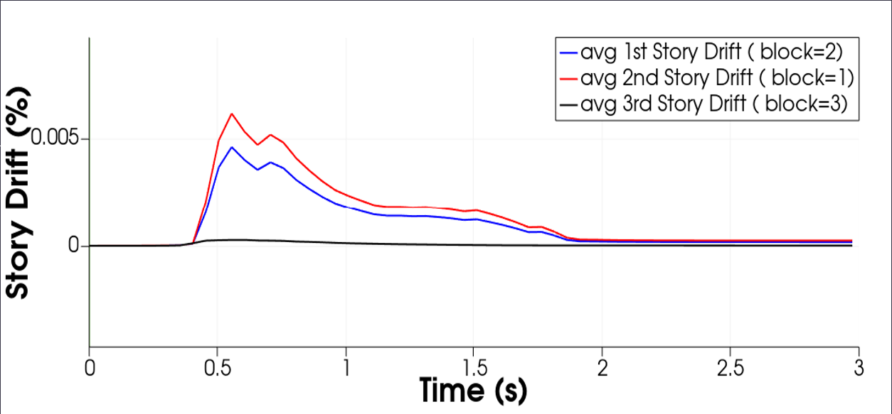

.. _hydro-0002:

Coupled Digital Twin Example - Oregon State University Large Wave Flume Coupled Simulation (Concrete Filled Tubes, Elevated Structure, Breaking Wave)

============================

An experimental campaign of two specimens tested at the Oregon State Univeristy O.H Hinsdale Wave Research Laboratory Large Wave Flume was modelled. Experimental work was conducted by a collaborative team from the University of Washington and Oregon State University led by master’s students Christopher Pyke and Kenneth Sullivan. CFD simulations and computational analysis were completed with the assistance of Chris Pyke, Kenneth Sullivan, Dakota Mascarenas, Andrew O. Winter, Ph.D, Dawn E. Lehman, Ph.D, Michael R. Motley, Ph.D., Pedro Arduino, Ph.D, and Charles W. Roeder, Ph.D. The faculty and staff at O.H. Hinsdale Wave Research Laboratory also contributed to this project and assisted with experimentation and data curation. As the experimental setup and results have been published previously in Lewis et. al, 2022 and are available in Pyke, 2020 and Sullivan, 2021, information pertaining to motivation, background, and irrelevant testing parameters are omitted here for brevity and clarity. Results from the strongly-coupled FSI analyses were compared to experimental results and analogous CFD analyses (identical mesh) with a rigid boundary representing each structure. 

Three Dimensional Elevated Structure Under Turbulent Breaking Solitary Wave Impingement with Real Structural Sections and Materials

In order to evaluate the efficacy of the force and displacement mapping routines for complex three dimensional geometries with an explicit coupling scheme, a 1:6 full scale structure studied experimentally by \cite{SULLIVAN:2021} within the Large Wave Flume at Oregon State University O.H. Hinsdale Wave Research Laboratory was modelled in OpenFOAM and FOAMySees. This experiment was almost identical in flume geometry, wave properties, and bathymetry to that of the previous section, so further details pertaining to these parameters are omitted here for brevity. Full experimental results are available in Kenneth Sullivan's Masters Thesis (\cite{SULLIVAN:2021}). Limited results are presented here for general force comparison between an explicit simulation and the experimental base shear measured by Sullivan. The model was run with an explicit coupling scheme for 4 seconds of simulation time at a timestep of 0.0005 seconds on 1 UW HYAK Klone HPC Node with 40 processors for a total computational time of 14 hours. This resulted in relaxation of the work transfer across the interface by means of numerical damping of the CFD model and omission of high-frequency interactions between the FEA model and the interface forces, but the simulation did not crash, which indicates that possibly the amount of participating artificial added-mass for this particular model and for these coupling settings was lower than the effective inertial resistance of the structure.  This study was primarily conducted to demonstrate usability of the software for three-dimensional turbulent cases, and is not intended as an experimental-validation study or as indication that explicit coupling schemes are stable or offer meaningful results. \\

OpenSees Model Description
The structure was 1.016	m by 1.016 m in plan from column center to column center, comprised of steel frame elements, steel gusset plates, and concrete filled steel tubes. HSS2x2x1/8 elements were framed horizontally between columns with their center-line at heights of 1.3208 m, 1.8288 m, and 2.3368 m. HSS1.5x1.5x1/4 elements were utilized for chevron bracing from  1.3208 m to 1.8288 m along all four sides of the structure. Panels spanned between HSS2x2 elements forming diaphragms within the structural plan footprint. For exact material properties of the experimental specimen and exact structural dimensions, see \cite{SULLIVAN:2021}. 
The concrete-filled-tubes were modelled in the same manner as those in the previous section, as the same concrete-filled-tubes were utilized for both specimens which were tested. Elastic beam sections were utilized for the HSS components of the frame. Elastic MITC4 shell elements were utilized for the modelling of the panels spanning across each story, which were given a thickness of 12.7 mm (1/2 in) and material properties of elastic steel. The model was again given Rayleigh damping in OpenSeesPy with a value of 7.5 \% from the frequency of the first structural mode ($f_1$) to five times that frequency (5$f_1$).   \\

Displacements, Forces, and Impulses

Mesh motion of OpenSeesPy, the FOAMySees displacement branch mesh, and OpenFOAM surface patches along with fluid free surface (isosurface at \alpha= 0.5) overlaid for selected times of the simulation are shown in Figures \ref{fig:MeshMotionComparison1} through \ref{fig:MeshMotionComparison3}. In Figure \ref{fig:MeshMotionComparison4}, a time history of the displacement of the top left corner on the upstream face of the structure in OpenSeesPy and its associated location in OpenFOAM are plotted alongside each other to demonstrate proper transfer of displacement during the simulation. To demonstrate proper transfer of force between coupled models, the forces applied to the branch nodes within FOAMySees were output and summed for comparison with the force calculated within OpenFOAM via functionObjects. The streamwise force time histories for both OpenFOAM and FOAMySees are shown along with experimentally measured forces from Sullivan (2021) for the duration of wave impingement in Figure \ref{fig: ForceComparisonFOAMyVsExperiment}. This analysis and experiment will be investigated with an implicitly-coupled model utilizing incremental time stepping within the OpenFOAM model in future work. 

.. raw:: html
    <video controls src="figures/Media1.mp4" width="620" height="620"/>

.. figure:: figures/Picture1.png
   :align: center
   :width: 600
   :figclass: align-center
   

   

   

   

