.. _hydro-0004:

Coupled Digital Twin Example - Oregon State University Large Wave Flume Coupled Simulation (Concrete Core Wall Structure, Breaking Wave)

============================
An experimental campaign of two specimens tested at the Oregon State Univeristy O.H Hinsdale Wave Research Laboratory Large Wave Flume was modelled. Experimental work was conducted by a collaborative team from the University of Washington and Oregon State University led by master’s students Christopher Pyke and Kenneth Sullivan. CFD simulations and computational analysis were completed with the assistance of Chris Pyke, Kenneth Sullivan, Dakota Mascarenas, Andrew O. Winter, Ph.D, Dawn E. Lehman, Ph.D, Michael R. Motley, Ph.D., Pedro Arduino, Ph.D, and Charles W. Roeder, Ph.D. The faculty and staff at O.H. Hinsdale Wave Research Laboratory also contributed to this project and assisted with experimentation and data curation. As the experimental setup and results have been published previously in Lewis et. al, 2022 and are available in Pyke, 2020 and Sullivan, 2021, information pertaining to motivation, background, and irrelevant testing parameters are omitted here for brevity and clarity. Results from the strongly-coupled FSI analyses were compared to experimental results and analogous CFD analyses (identical mesh) with a rigid boundary representing each structure.
Numerical Investigation With Computational Fluid Dynamics

The following section investigates the efficacy of CFD in simulating wave-structure interaction and hydrodynamics from paddle-generated breaking solitary waves and resolving experimental forces for integrated study of fluid behavior using a model at 1:1 scale with the experiments.

Model Description

Model dimensions can be seen in Fig. \ref{fig:Model Dimensions}. Atmospheric boundary conditions for variables U (velocity) and p$_{rgh}$ (dynamic pressure) were applied to the topmost boundary of the model. All walls except the atmosphere boundary were assigned standard wall boundary conditions for the simulation. Specific boundary condition types for the turbulence model and dynamic mesh library were applied to necessary regions of the model for initialization of mesh movement and satisfaction of the requirements for numerical stability. Waves were generated by a pneumatically-powered piston at one end of the wave flume, which then propagated down the length of the flume to a sloped bathymetry, forcing the waves to initially spill and then fully break, which results in a turbulent bore prior to the flow reaching the test structure.

\indent  In order to replicate the experimental wave motion and measured fluid loads imparted on the structure, the displacement of the paddle during experiments was recorded as a time history. This paddle displacement history was imposed on the wavemaker paddle surface in the OpenFOAM model using the olaFlow boundary condition function wavemakerMovement to specify the mesh motion. More specifically, mesh-morphing wave generation boundary conditions were used to mimic the piston-driven paddle wavemaker at the Hinsdale Wave Research Lab by prescribing the variable 'pointDisplacement' within OpenFOAM. All boundary conditions applied in the models are listed in Table \ref{tab:BC Field Variables}. For further information and a comprehensive evaluation of OpenFOAM boundary conditions used in Large Wave Flume Models such as those utilized in this study, see Winter (2020). 

Image
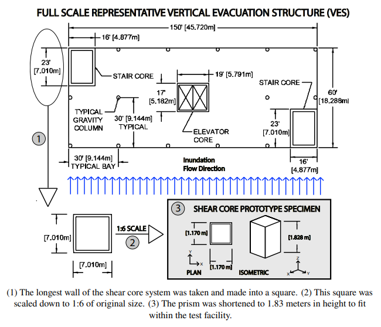
   caption
Image
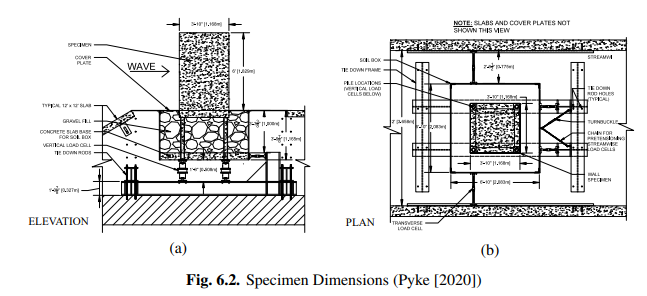
   caption
Image
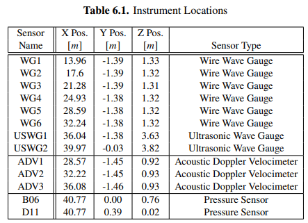
   caption
Image
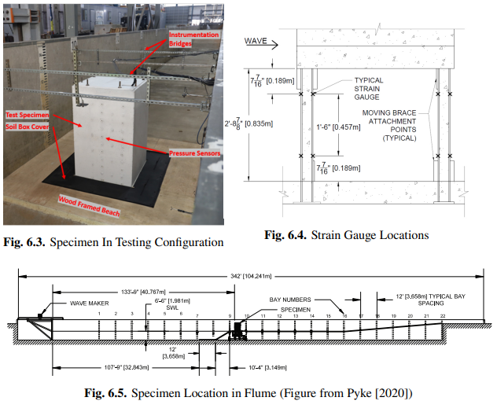
   caption
Image
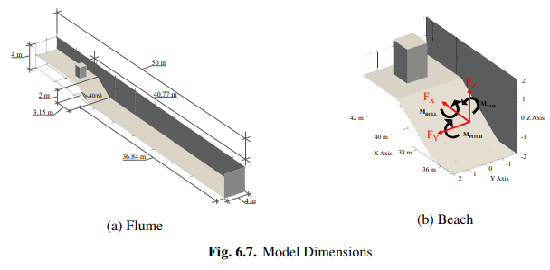
   caption
Image
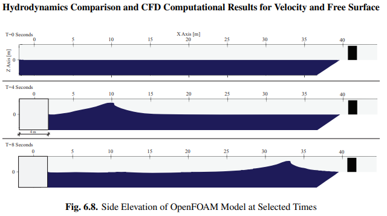
   caption
Image
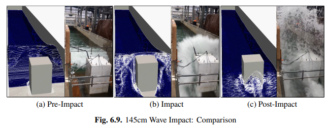
   caption
Image
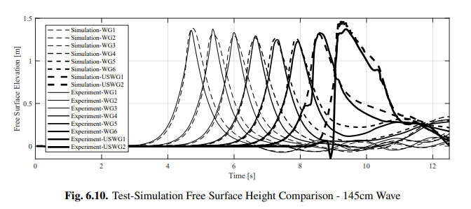
   caption

Hydrodynamics Comparison and CFD Computational Results for Velocity and Free Surface
The simulated results for wave movement, pressure distribution over the specimen, and structural forces were compared against the measured responses to evaluate the accuracy of the model. Fig. \ref{fig:0swave} shows elevation views of the simulated wave at various points of travel down the flume, as well as the end state (fully-extended) of the prescribed motion of the wavemaker as the water moves toward the test specimen.
The computational domain was comprised of 3.2 million points and 3 million cells, with cell sizes varying from 10 cm$\times$10 cm$\times$10 cm far from the structure to 1.5 cm$\times$1.5 cm$\times$1.5 cm near the structure. CFD model time discretization was initialized with a 1E-4 maximum and 1E-9 minimum time step, with time step size governed by a Courant-Friedrichs-Lewy (CFL) condition of 0.5. Models were run on UW Hyak Klone with 40 processors, with 128G of memory per processor, and took approximately 20 hours to complete. 

OpenFOAM Calculated Free Surface Values 
.. figure:: figures/WaveGauges.png
   :align: center
   :width: 600
   :figclass: align-center
    Wave Gauges

Image
.. figure:: figures/Capture15.PNG
   :align: center
   :width: 600
   :figclass: align-center
   caption
Image
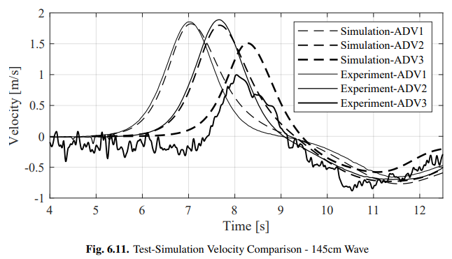
   caption
Image
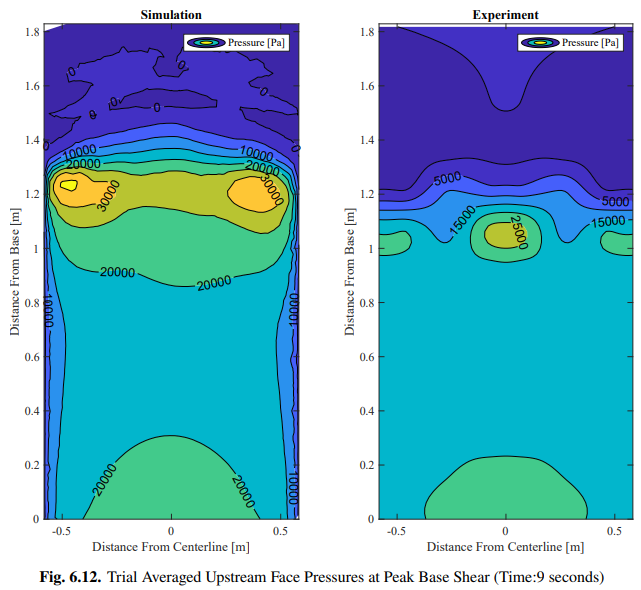
   caption
Image
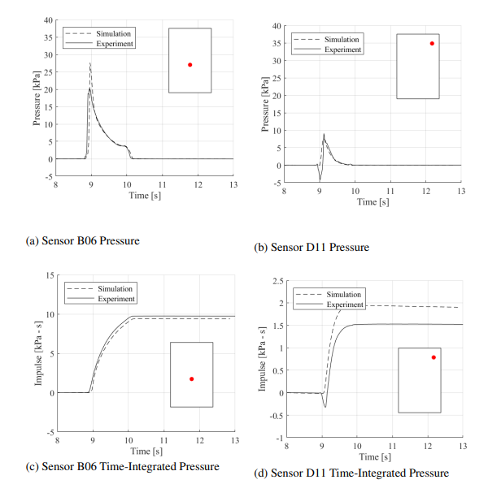
   caption
Image
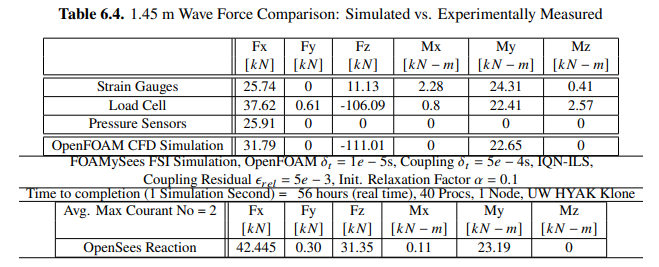
   caption
Image

OpenSees Model Details

A simplified OpenSees model was built of the concrete core wall specimen, along with the concrete-filled-tubes which supported the core wall. An elastic material with a modulus of elasticity of 5e9 Pascals, density of 2400 $kg/m^3$, and a Poisson ratio of 0.25 was utilized to model the concrete. An 'ElasticMembranePlateSection' with 6 inch thickness was used with 'ShellMITC4' elements roughly 10 cm x 10 cm in size comprising the core wall specimen geometry at the wall and slab centerlines. 
Uni-axial material properties for structural steel ('Steel02' model, with a yield stress of 344.75 MPa, initial elastic tangent of 200 GPa, strain-hardening ratio of 0.1, and isotropic hardening parameters of a1, a2, and a3 of 18.0, 0.925, and 0.15, respectively) and concrete ('Concrete02' model, with concrete compressive strength at 28 days of -49.64 MPa, concrete strain at maximum strength of -0.00326, concrete crushing strength of -9.93 MPa, concrete strain at crushing strength of -0.01631, ratio between unloading slope and initial slope of 0.1, tensile strength of 4.39 MPa, and tension softening stiffness of 2 GPa) respectively were chosen for modelling materials of the CFT tubes within OpenSeePy. Fiber sections with elastic uniaxial materials and 64 fibers each were utilized to represent the composite sections of the columns, which were standard 10.16 cm (4 in) steel pipes with 1.27 cm (1/2 in) thick walls filled with concrete. EqualDOF commands were utilized for connection of structural elements of different formulations within OpenSeesPy. The structure was fixed at its base.

The model was given Rayleigh damping in OpenSeesPy with a value of 7.5 \% from the frequency of the first structural mode ($f_1$) to five times that frequency (5$f_1$) with Rayleigh mass coefficients of $\alpha_{mass} = 0.0$ and Rayleigh stiffness coefficients of $\beta_{tangent} = 0.0, \beta_{initial} = \frac{\zeta*5f_1 - \zeta*f_1}{\pi*(5f_1^2 - f_1^2)},$ and $\beta_{committed}=0.0$.   \\

   caption
Image
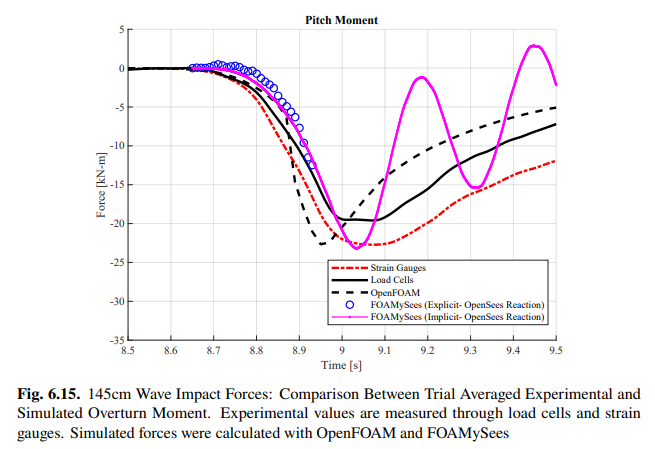
   caption
Image
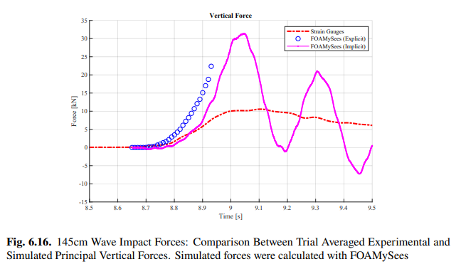
   caption
Image
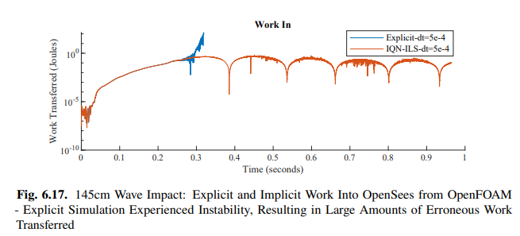
   caption
Image
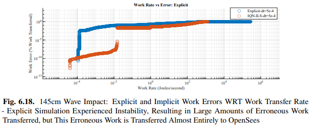
   caption
Image
%%%%%%%%%%%%%%%%%%%%%%%%%%%

Fluid-Structure-Interaction Analysis

Forces and moments from the CFD simulations slightly vary from those obtained from the experiments, but these force trends and magnitudes fall within 10 percent of the measured loads which are unaffected by slight asymmetries in the test frame's stiffness. These differences are still to be investigated in future research, however the agreement between forces obtained from experiments and numerical models is assumed to be within acceptable ranges for justifying further refinements to the modelling methodologies and advancement of the techniques implemented for tsunami-resilience-engineering purposes. Streamwise forces, overturn moment, and vertical forces from the experiments, CFD models, and FSI models are shown in Figure \ref{fig:OSUX}, Figure \ref{fig:OSUMY}, and Figure \ref{fig:OSUZ}, respectively. The simulation was run first with an implicit coupling scheme, with a coupling relative residual tolerance of 5e-3 and a coupling timestep of 5e-4s. The work input into the OpenSees model for both the implicit and explicit simulation are shown in Figure \ref{fig:OSUWorkIn}. The explicit simulation experiences an instability around the time of maximum force, resulting in large spikes in the resolved forces and large amounts of generated spurious work. The implicit simulation ensures that this work remains bounded through relative convergence of the data within each coupling timestep.
Errors for work transfer across interface with respect to work transfer rate is shown in Figure \ref{fig:OSUWorkRate}. It is expected that with a reduced timestep the work transfer errors which arise from the large coupling timestep size would be minimized - however, reduction of the timestep will increase the probability that the explicitly-coupled simulation will diverge due to the inherent added-mass instabilities of partitioned-explicit coupling. 

